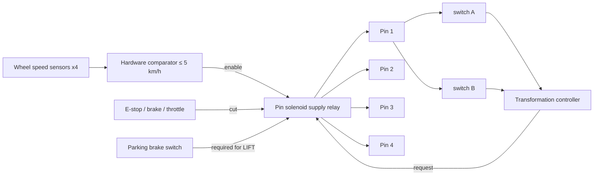

# Part 6 — Safety interlock system

## 6.1 Principles

1. **A mode is a set of verified hardware states, not a software variable.** The controller may only *declare* a mode after every gate in the table below has been confirmed by a physical switch or by two independent sensors that agree.
2. **Mechanically critical locks are never held by software.** Each carrier pin is spring-applied and solenoid-released; the solenoid supply passes through a hardware speed comparator, so no software state can unlock a corner above 5 km/h.
3. **Safe direction on any fault is "hold"**, never "retract" and never "deploy". Holding is always available (Part 5).
4. **The transformation controller is a separate safety-rated node** (target: ISO 13849-1 Category 3 / PL d for the lock and speed functions; ISO 26262 ASIL B for mode declaration, if the vehicle is homologated as an L-category road vehicle; ISO 25119 is the alternative framework if it is sold as an off-road machine [FS-1]).
5. **Rider intent is explicit**: a mode change needs a deliberate two-step input (select, then confirm within 5 s), and can be aborted at any time by any brake, throttle or the emergency stop.

## 6.2 Mode state machine

```mermaid
stateDiagram-v2
    [*] --> ROAD
    ROAD --> T_ROB : request + gates OK (v<=5 km/h, |pitch,roll|<=10°, no faults)
    T_ROB --> ROBOTIC : all 4 carriers at target ±1°, all pins engaged (2 switches each)
    T_ROB --> TRANSITION_FAULT : timeout / sensor disagreement / pin not engaged
    ROBOTIC --> T_ROAD : request + gates OK
    T_ROAD --> ROAD : all 4 carriers at 15° ±1°, pins engaged
    T_ROAD --> TRANSITION_FAULT
    ROBOTIC --> LIFT : request, v=0, park engaged, HV drive disabled
    LIFT --> KIT_SWAP : corner unloaded (arm at full rebound), pin engaged at 60°
    KIT_SWAP --> LIFT : kit ID read + adapter switch closed
    LIFT --> ROBOTIC : corner lowered, pin engaged
    ROBOTIC --> SNOW : 2x ski ID + 2x track ID + tension switches + rider confirm
    SNOW --> ROBOTIC : request; 4x wheel ID present
    ROAD --> LIFT : request, v=0, park, HV drive disabled
    TRANSITION_FAULT --> ROBOTIC : fault cleared, all pins engaged, carriers within robotic band
    TRANSITION_FAULT --> LIMP : any pin not confirmed (5 km/h)
    state "MARINE (variant only)" as M
    ROAD --> M : afloat detected + hull gates OK (see 6.5)
    M --> ROAD : wheels down + pins + ashore
```



Speed caps by state: ROAD none (60 km/h design); ROBOTIC 25 km/h with pins engaged, 5 km/h while any pin is released; SNOW 45 km/h; TRANSITION and LIFT 0–5 km/h; LIMP 5 km/h; MARINE displacement 4 kn until planing gates pass.

## 6.3 ROAD → ROBOTIC (and back)

| Step | Gate | Verified by | Fail action |
|---|---|---|---|
| 1 | Rider request + confirm | HMI two-step | none |
| 2 | Vehicle speed ≤ 5 km/h | 4 wheel-speed sensors + IMU; hardware comparator on the solenoid supply | refuse |
| 3 | Steering within ±10° of centre | rack position sensor (front modules only need this so the tie-rods stay near the axis plane during the move) | prompt |
| 4 | Pitch and roll ≤ 10° | IMU | refuse |
| 5 | No corner faults; 24 V ≥ 22 V; HV SOC ≥ 10% | fault registers, rail monitor, BMS | refuse |
| 6 | All four pins reported engaged | 2 switches per pin | refuse (a corner already unlocked means an unresolved fault) |
| 7 | Actuators pre-load toward the target to unload the pins | actuator current signature | abort |
| 8 | Solenoids energise; pins retract within 300 ms | 2 switches per pin | abort, re-brake |
| 9 | Actuators move in synchronism (±2°) to target | carrier sensors ×4, actuator positions ×4 | abort to nearest slot on divergence |
| 10 | Targets reached ±1°; arm sensors within travel band | sensors | TRANSITION_FAULT |
| 11 | Solenoids de-energise; pins engage | 2 switches per pin | jog ±2° and retry once; else TRANSITION_FAULT |
| 12 | Actuator brakes applied | brake feedback | flag |
| 13 | Declare ROBOTIC (or ROAD); set torque/regen/ESC maps and speed cap | — | — |

Return ROBOTIC → ROAD is identical with the ROAD target; it additionally requires all four kit IDs to read "wheel" (a ski or track cannot be driven at road speeds).

## 6.4 ROAD → SKI (swap-in sequence) and SKI → ROAD

```
ROAD ──► [v=0, Park, HV drive disabled, |pitch,roll| ≤ 5°] ──► LIFT corner i
        ──► [arm i at full rebound = wheel unloaded; pin i engaged at 60°]
        ──► KIT_SWAP i: rider removes wheel, fits ski adapter (front) / track cassette (rear)
        ──► [kit ID tag = expected type; adapter seated switch; (rear) tension switch]
        ──► lower corner i to 15° (front) / 25° (rear); pin engaged
        ──► next corner (order: FL, FR, RL, RR)
        ──► [2 ski IDs, 2 track IDs, 4 adapter switches, 2 tension switches]
        ──► rider confirm ──► SNOW: track drive map, 45 km/h cap, regen limited, ESC snow map
```

Snow propulsion is enabled only after the two tension switches and the two sprocket-speed sensors report plausibly (drive coupling confirmed by rotating each track 1/4 turn at 10% torque with the corner still lifted: sprocket speed must match hub speed within 2%). That is the "drive coupling confirmed" step from the brief, done at zero risk because the corner is in the air.

SKI → ROAD: the reverse; ROAD is declared only with four wheel IDs and four adapter switches open.

## 6.5 ROAD → MARINE (marine variant only)

| Step | Gate | Verified by |
|---|---|---|
| 1 | Vehicle stopped or ≤ 5 km/h; entering water at ≤ 5 km/h on a ramp | wheel speed |
| 2 | Hull condition: all bay doors/bulkhead hatches closed | hatch switches (2 per hatch) |
| 3 | Bilge dry; bilge pumps self-test | float switches; pump current |
| 4 | Battery box dry; IMD isolation ≥ 500 Ω/V | conductivity sensor; IMD |
| 5 | Afloat: buoyancy fraction ≥ 90% | all four arm sensors at full rebound (wheel unloaded) for > 3 s, plus hull water-level sensors — the buoyancy-fraction method is the approach disclosed in expired Gibbs applications [PAT-41] |
| 6 | Marine propulsion confirmed | jet motor spin test at 10% with the reverse bucket in neutral; thrust confirmed by motor current (the "confirm thrust before retracting" interlock of expired US 5,562,066 [PAT-42]) |
| 7 | Wheels retract (carriers to −70°); pins engage | carrier sensors, pin switches |
| 8 | Land drive disabled (contactor to traction inverters open; hub brakes released) | inverter state |
| 9 | Declare MARINE-DISPLACEMENT (≤ 4 kn) | — |
| 10 | Planing enabled only if: wheels stowed, bilge dry, rider seated (seat switch), lanyard kill-cord attached, water depth ≥ 1 m (sonar), hull speed gates | sensors |

MARINE → ROAD: reverse; wheels are lowered while afloat before touching the ramp, land drive enabled only when at least two arm sensors show wheel load and the hull water-level sensor shows the keel above water. Brakes are exercised once before land speed is released.

## 6.6 Hardware, not software, for the critical locks



The comparator and the E-stop path are discrete electronics with no programmable logic, in the spirit of the Formula Student rule that the isolation monitoring device must open the shutdown circuit "without the influence of any programmable logic" [HV-9].

## 6.7 What the interlock system cannot do

It cannot make a partially transformed vehicle handle like a fully transformed one; hence the speed caps. It cannot verify that a rider has torqued lug nuts; hence the kit-swap procedure includes a torque-stripe visual and the owner's manual, exactly as for any wheel change. It cannot detect a cracked arm before failure; hence Part 10's inspection intervals.
