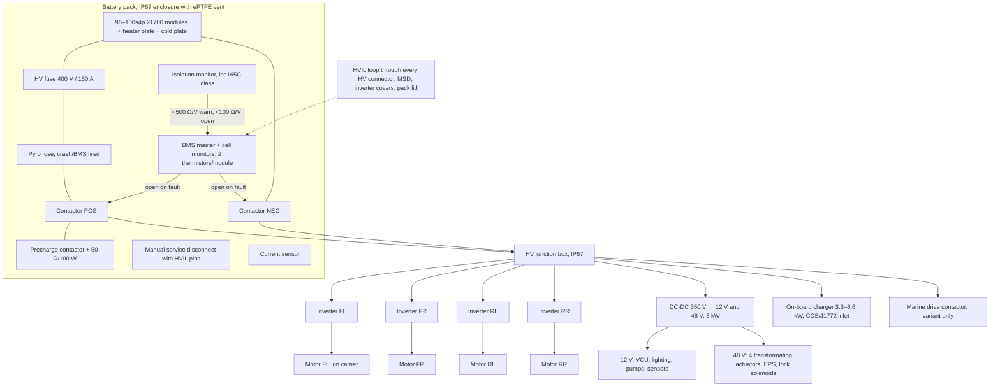

# Part 11 — Battery and electrical architecture

## 11.1 Sizing comes first (from `calc/energy.py`, RC-0)

| Duty | Result |
|---|---|
| Road, mixed duty cycle (20% climbing at 20 km/h, 50% at 40 km/h, 30% at 60 km/h) | 133 Wh/km average at the battery |
| Range 60 km road → nominal pack | 9.4 kWh (85% usable) |
| Range 80 km road → nominal pack | 12.5 kWh |
| Snow at 30 km/h on tracks (c_rr 0.12 assumed) | 265 Wh/km → 12 kWh gives ~38 km |
| Peak power (0–60 km/h in 6 s) | ~34 kW at the wheels → ~40 kW at the battery |

**Decision: 12 kWh nominal, 40 kW peak / 20 kW continuous discharge**, ~80 kg at a conservative 150 Wh/kg pack level (industry pack averages are 162–175 Wh/kg; Taiga's PWC pack is ~184 Wh/kg [BAT-1][BAT-2]). This is above the Can-Am Outlander Electric's 8.9 kWh [SUP-7] and well below the Ranger XP Kinetic's 29.8 kWh [EV-1], which is consistent with a 440 kg recreational vehicle. The pack is sized by the road duty cycle; the snow range (~38 km) is the honest consequence, comparable to what track kits do to any ATV's range.

Cell choice: 21700 NMC/NCA cylindrical (242–270 Wh/kg cell [BAT-1]) in a 96s4p to 100s4p arrangement gives ~350–370 V nominal, 4 × 4.5 Ah = 18 Ah, 12.5–13 kWh; 45 A cells support 180 A (65 kW) peaks. LFP (205 Wh/kg cell) is the safer chemistry but loses cold-weather charging (< 0 °C restricted [BAT-1]), which matters for a snow vehicle; NMC with a pack heater is the choice.

Voltage class: **class B, ~350 V** (ISO 21498: > 60 V DC [HV-2]). A 96–150 V "powersports" bus was considered; at 40 kW it needs 270–420 A cabling and limits motor/inverter choice. 350 V matches automotive-grade inverters with HVIL and IP6K9K (CM200 class [MOT-7]) and PWC packs (Taiga 355 V [BAT-2]).

## 11.2 Architecture

### Element by element

| Element | Design | Basis |
|---|---|---|
| **Battery enclosure** | welded/bonded 5083 tray with a bolted lid, EPDM gasket at 25–30% squeeze, ePTFE pressure-equalising vent (a sealed box quenched from 65 °C to 15 °C pulls ~176 mbar vacuum through its seals [BAT-5]), IP67 as a unit; on the marine variant IP68 (1 m, 30 min) plus a float switch; mounted between the sills, lowest mass in the vehicle; vent path for thermal events routed to the underside away from the rider | [HV-3][BAT-5] |
| **BMS** | master + slave monitors, cell voltage ±5 mV at ≥ 10 Hz, ≥ 2 thermistors per module, current sensor; runaway signature (> 1 °C/s, > 100 mV/s drop) opens contactors within 100 ms; safety path ASIL-B target for contactor control (ASIL-D is the automotive reference [FS-1]) | [FS-1][BAT-6] |
| **Contactors** | two hermetic EV200-class main contactors (500 A carry, 2,000 A break once, 0.43 kg, 1.7 W hold) [HV-10]; normally open, so loss of power = open = safe | [HV-10] |
| **Precharge** | resistor + small contactor; close the main POS only when the DC-link reaches ≥ 90–95% of pack voltage (EV200 make life falls from 50,000 cycles at 90% precharge to 50 cycles at 80% [HV-10]); R = t/(5·C): with ~2 mF total DC-link and 50 Ω, τ = 0.1 s, done in 0.5 s; abort to OPEN if not reached in 2 s (short detection) | [HV-10][HV-12] |
| **HV interlock (HVIL)** | 12 V low-current series loop through every HV connector (last-make/first-break pins), the MSD, inverter and junction-box covers, pack lid; any break opens the contactors regardless of vehicle state | [HV-13] |
| **Fuse** | main HV fuse 150 A class, 500 V DC rating; conductor targets 1.0–1.6 A/mm²; inverter branch fuses | [HV-14] |
| **Pyro fuse** | crash-signal and BMS-fired pyrotechnic disconnect, < 1 ms | [HV-14] |
| **Isolation monitoring** | iso165C-class IMD (0–600 V, < 2.5 W, warning default 300 kΩ / error 55 kΩ; response ≤ 20 s) [HV-11]; warning ≥ 500 Ω/V, open contactors when stationary at < 100 Ω/V (FMVSS 305 with monitoring [HV-6]); mandatory check before closing contactors; on the marine variant the IMD trend is the first water-ingress detector | [HV-11][HV-9] |
| **Emergency disconnect** | rider E-stop on the bar → opens contactors via the BMS *and* via a hardware relay in the contactor coil supply; lanyard kill-cord (marine); crash IMU → pyro | |
| **Manual service disconnect** | two-stage MSD on the pack (stage 1 breaks HVIL, stage 2 breaks HV) [HV-13] | |
| **Motor controllers** | four automotive-grade inverters, 20–30 kW class, IP6K9K/IP67 with HVIL support (CM200 family is 225 kW class and oversized; the 20–30 kW class from the same suppliers is the target) [MOT-7]; 100 Hz torque command update for traction control/vectoring [TV-1] | |
| **Low-voltage system** | DC-DC 350 → 12 V (1.5 kW) and 350 → 48 V (1.5 kW): 48 V for the four transformation actuators, EPS and lock solenoids keeps them in voltage class A (≤ 60 V) with no HVIL/IMD burden and 4× lower current than 12 V [HV-2][LV-2]; a 12 V 20 Ah AGM/LFP backup runs bilge pumps, lighting, VCU and one lock-release cycle with the HV pack off | [LV-1] |
| **Cooling** | one glycol loop: pack cold plate (heater in winter) → four inverters → four motors (through 45° service loops on the carriers) → radiator with fan in the nose; 15–35 °C pack target [BAT-6]; the loop also warms the actuator/pin housings (Part 5, freezing) | |
| **Waterproofing** | all HV connectors IP68/IP6K9K with HVIL [BAT-4]; LV Deutsch DT class; every sealed housing vented; thermal-shock test (hot component into 5 °C water) is a specific test case [UNS-3] | |
| **Charging** | on-board 3.3 kW (6.6 kW option) J1772/Type 2; DC fast charge is a marine-variant option (Taiga-style CCS [EV-2]) | |

## 11.3 Standards map

| Standard | Applies to | Use |
|---|---|---|
| ISO 6469-1/-2/-3 [HV-1] | RESS, functional safety, electrical protection | design baseline for the class-B system |
| ISO 13063-1/-2/-3, UN R136 [HV-7] | L-category electric vehicles (EU route) | pack tests incl. drop; the closest legal analogue to a straddle-seat EV |
| UN R100 Rev.3 Annex 9 [HV-4] | REESS tests (vibration, thermal shock, mechanical shock, fire, short, over/under charge, over-temperature/current), 5-min thermal propagation warning | test plan |
| UL 2580 [HV-5] | pack-level incl. **seawater immersion** and single-cell failure | mandatory for the marine variant, recommended for all |
| ISO 16750-2/-3/-4 [HV-8] | component environmental (transients, vibration, thermal shock, salt spray, dust/water) | component qualification |
| ISO 20653 / IEC 60529 [HV-3] | IP codes | IP67 pack, IP6K9K inverters, IP69K static / IP66 dynamic actuators |
| ISO 16315, ABYC E-30, E-13 [MST-6][MST-7] | marine electric propulsion, lithium on boats | marine variant |
| ISO 26262 / ISO 13849 / ISO 25119 [FS-1] | functional safety framework | choose per homologation route (Part 6) |

## 11.4 What must not be assumed yet

The 12 kWh figure follows from RC-0's mass, rolling resistance and duty-cycle assumptions. If the road-mode duty cycle is measured at 180 Wh/km on a prototype (plausible on soft ground), the same 60 km target needs 12.7 kWh. Pack size is therefore locked only after the rolling-chassis measurements of Part 13 Stage 3.
